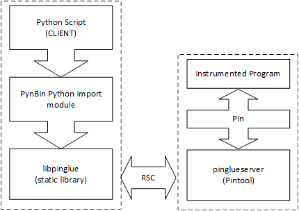
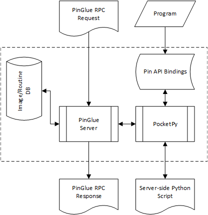

<!---
Copyright (C) 2024-2024 Intel Corporation.
SPDX-License-Identifier: MIT
-->

# PinGlue - Language Bindings For Pin

> - [Introduction](#introduction)
> - [Setup](#setup)
>   - [Dependencies](#dependencies)
>   - [Building](#building)
>   - [Testing](#testing)
> - [Quick Start](#quick-start)
>   - [Setting Up The Environment](#setting-up-the-environment)
>   - [Creating a PinGlue Service](#creating-a-pinglue-service)
>   - [Creating a Client-Side Python Script](#creating-a-client-side-python-script)
> - [Writing PinGlue Scripts](#writing-pinglue-scripts)
>   - [Writing Python Pintools](#writing-python-pintools)
>   - [Writing PinGlue Python Services](#writing-pinglue-python-services)
>   - [PinGlue Limitations](#pinglue-limitations)
>   - [Notable Pin API Changes With PinGlue Scripts](#notable-pin-api-changes-with-pinglue-scripts)
>     - [Instrumenting Multi-Threaded Applications With PinGlue](#instrumenting-multi-threaded-applications-with-pinglue)
>     - [Using Timers](#using-timers)
>   - [Unimplemented Pin APIs](#unimplemented-pin-apis)
> - [Using PynBin](#using-pynbin)
>   - [The PynBin Concept](#the-pynbin-concept)
>   - [Instrumenting Multithreaded Applications](#instrumenting-multithreaded-applications)
>   - [PynBin PinGlue callback decorators](#pynbin-pinglue-callback-decorators)
>   - [PynBin Limitations](#pynbin-limitations)

# Introduction

Traditional binary instrumentation has conventionally relied on C or C++ programming languages. Existing frameworks predominantly offer API bindings for these languages. However, the evolving landscape of technology—marked by advancements such as Deep learning, Data center, and Cloud computing — alongside escalating cybersecurity threats, necessitates swift and adaptable approaches for prototyping and deploying binary instrumentation solutions. In response to this demand, we present an innovative infrastructure based on Intel’s Pin Dynamic Binary Instrumentation framework  enabling a fully Python-scriptable methodology for binary instrumentation. Our approach aims to revolutionize the conventional practice by facilitating rapid prototyping and seamless deployment of binary instrumentation solutions.

PinGlue is a framework for creating language bindings for Pin. It includes two main components: a Pintool called `pinglueserver` and `libpinglue`, a C library used to create language bindings. Bindings can be created for any language that supports C interoperability like Python, Rust, C#, and Java to name a few.

Due to Pin's restrictions on third-party library utilization, we adopted a client/server architecture for the PinGlue framework. In this setup, a Pintool named `pinglueserver` is the server loaded by Pin, and `libpinglue` is employed to create the actual language bindings by the binding language client. A Remote Procedure Call (RPC) protocol named RSC is used for communication between a process employing `libpinglue`, and `pinglueserver` running under Pin.

We demonstrate the usage of the PinGlue framework by providing PynBin, a Python module that allows regular Python scripts to run and interact with services loaded by `pinglueserver`.

PynBin exposes to a Python script the possibility to execute Pin on an application and instrument it under PinGlue.
Using PinGlue terminology, a Python script using PynBin module is the client and Pin running `pinglueserver` is the server.
Communincating with the server is done through `libpinglue`.

|  |
|:-|
| _PynBin + PinGlue Block Diagram_ |

For more information see [Writing PinGlue Scripts](#writing-pinglue-scripts) and [Using PynBin](#using-pynbin).

`pinglueserver` uses pocketpy as an embedded scripting engine to run server side scripts and it supports two modes of operation. The first is a simple PinGlue server side Pintool script (PinGlue Script) in which it is possible to write a standalone Pintool script using the server side Python scripting language. The second mode allows loading a PinGlue script as a service (PinGlue Service) following a request from a client using `libpinglue`.

|  |
|:-|
| _PinGLue Server Block Diagram_ |

> **_NOTE:_** Although pocketpy provides a fairly complete Python 3 implementation, not all Python 3 features are supported. It is also not possible to import external Python modules. The pocketpy version used is 1.4.1. For more information see [Writing PinGlue Scripts](#writing-pinglue-scripts).


This package provides three components:

1. `pinglueserver` - A Pintool that allows writing Python Pintool scripts (PinGlue Scripts) and either run them directly or use them as services (PinGlue Services) that can be executed on demand. Source code can be found under `glue/pinglueserver`.
2. `libpinglue` - A static library that allows interacting with `pinglueserver` to execute Python services. Source code can be found under `glue/libpinglue`.
3. PynBin - A Python module that used `libpinglue` to allow a Python client to run Python Pintool services. Source code can be found under `python/pynbin`.

Code examples can be found in the following locations:

1. PinGlue Scripts (Python Pintools) can be found under `glue/pinglueserver/tests/Scripts`.
2. Usage of `libpinglue` can be found in `glue/libpinglue/test/test_libpinglue.c` and in PybBin Cython implementation: `python/pynbin/cymod/pypinglue.pyx`.
3. PynBin examples can be found under `python/tests` and corresponding PinGlue services can be found under `python/tests/TestServices`.

# Setup

## Dependencies

- Linux kernel version >= 4.12.14
- GCC  Version  range[9.1, 14] (Requires `<filesystem>`)
- Make (>= 4.0)
- Python (>= 3.10)
- Cython (>= 3.0.8)
- Pin 4.x

## Building

> **_NOTE:_** Although this package is currently distributed as part of Pin, its structure does not assume so. For this reason the path to where the Pin kit is installed has to be passed to the make command.

```bash
make PINKIT=<path to pinkit>
```

By default all components are built  for the architecture of the host machine. If instrumenting 32-bit applications on 64-bit machines is required then `pinglueserver` has to built for 32-bit as well:

```bash
make PINKIT=<path to pinkit> TARGET=ia32 pinglueserver
```

> **_NOTE:_** Building for 32-bit on a 64-bit machine requires 32-bit compiler runtime support (libgcc etc.). 32-bit CRT support is not required because pinglue server is a Pintool and uses Pin's runtime.

On systems where Python 3 is not installed in a standard way it may be required to tell setup where it is installed:

```bash
make PINKIT=<path to pinkit> PYTHON3=<path to real python3 binary>
```

During installation of PynBin the latest `pip3` and `cython` are installed into a local virtual environment
which is deleted once the installation completes. It may be required to pass additional arguments to `pip3` like a proxy server or other global parameters. These can be specified using `PIP_GLOBAL_ARGS="<pip args>"` as part of the command line.

To override the compiler to be used it is possible to pass `CC=<gcc path>` and `CXX=<g++ path>` to the `setup` command. Please note that the only compiler tested is `gcc`/`g++`.

It is possible to run a parallel build with the `-j N` flag where `N` is the number of parallel jobs:

```bash
make PINKIT=<path to pinkit> -j 8
```

## Testing

To run all tests for all components (`pinglueserver`, `libpinglue` and `PynBin`)

```bash
make PINKIT=<path to pinkit> test
```

On 64-bit systems (Most standard Linux distributions) it is possible to run the test suit on 32-bit applications by adding `TARGET=ia32` to the test command:

```bash
make PINKIT=<path to pinkit> TARGET=ia32 test
```

It is possible to run tests in parallel with the `-j N` flag where `N` is the number of parallel jobs:

```bash
make PINKIT=<path to pinkit> -J 8 test
```

It is possible to test separately the different components:

```bash
make PINKIT=<path to pinkit> pinglueserver-full.test
make PINKIT=<path to pinkit> libpinglue-full.test
make PINKIT=<path to pinkit> pynbin-full.test
```

# Quick Start

In this section we will see how to create a simple PinGlue service and how to use it from a regular Python script.

## Setting Up The Environment

1. Make sure to setup the package as described in the [above section](#setup).
2. Create the directories for your scripts. We will use the name `gluetest` for this section:

```bash
mkdir -p gluetest/services
```

3. Define the `GLUE_PIN_KIT` environment variable to point to where the kit is installed:

```bash
export GLUE_PIN_KIT="<path to pinkit>"
export PYTHONPATH="<path to bindings>/python:$PYTHONPATH"
```

> **_NOTE:_** The snippets above assume the shell is bash.

> **_NOTE:_** If the default distribution is used then `<path to bindings>` will be `<path to kit>/bindings`.

## Creating a PinGlue Service

Server-side PinGlue service scripts have full access to Pin API but only limited access to Python modules, in particular they can't access external Python modules at all.

In the following example we will present a PinGlue service that can be used to count calls to functions specified by a client. The service is written using Python, it has access to Pin API, and it can interact with a client through remote function calls.

First we need to import the python modules we will use. For this service we will use the `json` module which is supported by pocketpy and the `pin` module that exposes Pin API.

```py
import json # pocketpy support the json module
import pin  # expose Pin API to service
```

Next we will register instrumentation callbacks:

```py
# Add instrumentation callback functions
pin.IMG_AddInstrumentFunction(image_instrumentation_cb)
pin.PIN_AddFiniFunction(fini)
```

In the `fini` function we will take the call count information we collected and report it back to the client. Every service must finalize its operation by sending a JSON to the client. The contents of the JSON are freely determined by the service:

```py
def fini(code):
    """Finalization function called when the Pin tool is about to terminate.

    Args:
    code: The exit code with which the Pin tool is terminating.
    """
    
    global call_trace_count_map
    result_json = {}
    
    # Aggregate call count and location data into a JSON-compatible dictionary
    for name in call_trace_count_map:
        result_json[name] = {"CallCount": call_trace_count_map[name]}
    
    # Convert the result dictionary to a JSON string
    result_json_str = json.dumps(result_json)
    
    # Send the result to the client
    Glue_SendServiceResultCallback(result_json_str)
```

In the image load callback, `image_instrumentation_cb` we will iterate over all the routines in the instrumented program and for each routine, ask the client whether it wants to track the calls or not. This is done by calling a function, `should_track_rtn`, that does not exist in the service code, and that must be registered by the client as a remote callback. From the service code perspective, it is like any other function call. For each routine the client wants to track we register an analysis callback, `rtn_cb`:

```py
def image_instrumentation_cb(img):
    """Callback function for instrumenting images.
    Args:
    img: The image object to be instrumented.
    """
    img_name = pin.IMG_Name(img)
    sec = pin.IMG_SecHead(img)
    while(pin.SEC_Valid(sec)):
        rtn = pin.SEC_RtnHead(sec)
        while(pin.RTN_Valid(rtn)):
            rtn_name = pin.RTN_Name(rtn)
            
            # Check with the user-defined client callback whether
            # to instrument the routine
            # should_track_rtn does not exist in this code and
            # has to be registered by the client for this service
            # to work
            if(should_track_rtn(img_name, rtn_name)):
                pin.RTN_Open(rtn)
                name =  rtn_name + "@" + img_name
                # Insert a call to the routine callback before the routine execution
                # A string to be passed as an argument to an analysis routine is of type
                # IARG_PYOBJ
                pin.RTN_InsertCall(rtn, pin.IPOINT_BEFORE, rtn_cb, pin.IARG_PYOBJ, name)
                pin.RTN_Close(rtn)
                
                # Initialize the call count and location information for the routine
                global call_trace_count_map
                call_trace_count_map[name] = 0
            
            rtn = pin.RTN_Next(rtn)
        sec = pin.SEC_Next(sec)
```

And putting it all together we get:

```py
# callcount service
import json # pocketpy support the json module
import pin  # expose Pin API to service

# Maps to keep track of call counts and locations
call_trace_count_map = {}

def rtn_cb(name):
    """Callback function that increments the call count for a given routine name.
    Args:
    name (str): The name of the routine being called and it's image (in format of <routine name>@<image name> ).
    """
    global call_trace_count_map
    assert(name in call_trace_count_map)
    call_trace_count_map[name] += 1

def image_instrumentation_cb(img):
    """Callback function for instrumenting images.
    Args:
    img: The image object to be instrumented.
    """
    img_name = pin.IMG_Name(img)
    sec = pin.IMG_SecHead(img)
    while(pin.SEC_Valid(sec)):
        rtn = pin.SEC_RtnHead(sec)
        while(pin.RTN_Valid(rtn)):
            rtn_name = pin.RTN_Name(rtn)
            
            # Check with the user-defined client callback whether
            # to instrument the routine
            # should_track_rtn does not exist in this code and
            # has to be registered by the client for this service
            # to work
            if(should_track_rtn(img_name, rtn_name)):
                pin.RTN_Open(rtn)
                name =  rtn_name + "@" + img_name
                # Insert a call to the routine callback before the routine execution
                # A string to be passed as an argument to an analysis routine is of type
                # IARG_PYOBJ
                pin.RTN_InsertCall(rtn, pin.IPOINT_BEFORE, rtn_cb, pin.IARG_PYOBJ, name)
                pin.RTN_Close(rtn)
                
                # Initialize the call count and location information for the routine
                global call_trace_count_map
                call_trace_count_map[name] = 0
            
            rtn = pin.RTN_Next(rtn)
        sec = pin.SEC_Next(sec)
    
def fini(code):
    """Finalization function called when the Pin tool is about to terminate.

    Args:
    code: The exit code with which the Pin tool is terminating.
    """
    
    global call_trace_count_map
    result_json = {}
    
    # Aggregate call count and location data into a JSON-compatible dictionary
    for name in call_trace_count_map:
        result_json[name] = {"CallCount": call_trace_count_map[name]}
    
    # Convert the result dictionary to a JSON string
    result_json_str = json.dumps(result_json)
    
    # Send the result to the client
    Glue_SendServiceResultCallback(result_json_str)

# Add instrumentation callback functions
pin.IMG_AddInstrumentFunction(image_instrumentation_cb)
pin.PIN_AddFiniFunction(fini)
```

Save the code above to `gluetest/services` under the name `callcount`.

## Creating a Client-Side Python Script

Client-side Python scripts are regular Python scripts. They have full access to all Python modules installed under environment in use. They don't have direct access to Pin API but they can use PynBin module to interact with PinGlue services executed by `pinglueserver`.

First we will import the modules we require:

```py
import json
from pynbin import *
```

Next we will write the code required to setup a Pin instance:

```py
    pin = Pin.parse_args()
```

In the snippet above we use the `parse_args()` static method which creates a Pin instance object using the command line arguments passed to the script.

Next we create a service object:

```py
    service = Service("callcount").with_function_target(callback=should_instrument)
```

To create the `Service` object we pass the name of the service we created in the previous section. We further register a remote callback with a local name of `should_instrument`.

The next step is to create an instrumentation request and start Pin.

```py
    # Create a service instrumentation request
    pin.instrument(service)
    # Start the instrumentation process
    pin.start(wait_done=False)
```

Because in the above code we pass `wait_done=False` the call to `pin.start` will not block. Calling `pin.start` without arguments or with `wait_done=True` will block until Pin exits. However a service has to be waited upon separately, because we don't want to create a multi-threaded script, we avoid waiting inside `pin.start`. Instead we will wait for Pin after the service has finished. We wait for the service result using the following code:

```py
    service_result  = service.wait_for_result()
    json_result = json.loads(service_result)
    print(json.dumps(json_result, indent=4))
```

Finally we need to wait for Pin to finish:

```py
    pin.wait_until_done()
```

We now look at how to implement the `should_instrument` callback:

```py
# Using a decorator to define a PinGlue function that
# can be called from a service. We specify the name
# the service expects with remote_name
@pinglue_function(remote_name="should_track_rtn")
def should_instrument(img_name, rtn_name):
    if "malloc" == rtn_name or "free" == rtn_name:
        return True
    return False
```

The code snippet above shows how to define a function that will be called every time the service calls `should_track_rtn`. It is possible to use the `@pinglue_function` decorator if we wish to specify a remote name or the `@pinglue_callback` decorator if the local name is the same as the remote name.

Putting it all together we get:

```py
import json
from pynbin import *

# Using a decorator to define a PinGlue function that
# can be called from a service. We specify the name
# the service expects with remote_name
@pinglue_function(remote_name="should_track_rtn")
def should_instrument(img_name, rtn_name):
    if "malloc" == rtn_name or "free" == rtn_name:
        return True
    return False

# Notes:
# 1. GLUE_PIN_KIT environment variable MUST be set.
if __name__ == "__main__":
    pin = pynbin.Pin.parse_args()
    
    service = Service("callcount").with_function_target(callback=should_instrument)

    pin.instrument(service)

    pin.start(wait_done=False)

    service_result  = service.wait_for_result()
    json_result = json.loads(service_result)
    print(json.dumps(json_result, indent=4))

    pin.wait_until_done()
    print("Done!")
```

Save the file as `gluetest/callcount.py`.

We can now run this test to count calls to `malloc` and `free` in an application:

```bash
cd gluetest
python3 callcount.py --glueargs="-services-path services" -- /bin/ls -la
```

The call to `Pin.parse_args()` will extract the PinGlue server argument pointing to the location of the services directory where our `callcount` service can be found. It will also properly detect the program we wish to instrument and its arguments.

For more information on the full capabilities of PynBin, please see [PynBin](#using-pynbin).

# Writing PinGlue Scripts

PinGlue scripts are written using a subset of Python 3.x implemented with pocketpy.
PinGlue provides bindings to almost all of Pin APIs, allowing writing a Pintool completely using Python.

Although pocketpy provides a fairly complete Python 3 implementation, not all Python 3 features are supported. It is also not possible to import external Python modules. The pocketpy version used is 1.4.1.

For more information see:
- [pocketpy differences from CPython](https://github.com/pocketpy/pocketpy/blob/v1.4.1/docs/features/differences.md)
- [pocketpy modules](https://github.com/pocketpy/pocketpy/tree/v1.4.1/docs/modules)

## Writing Python Pintools

This section discusses writing PinGlue Python Pintool scripts that run entirely on the server side without interacting with a client.

Here is an example of a simple instruction counting Pintool written in Python:

```py
import pin
total = 0

def docount(c):
    global total
    total += c
    

def trace_instrumentation_cb(trace):
    bbl = pin.TRACE_BblHead(trace)
    while(pin.BBL_Valid(bbl)):
        pin.BBL_InsertCall(bbl, pin.IPOINT_BEFORE, docount, pin.IARG_UINT32, pin.BBL_NumIns(bbl))
        bbl = pin.BBL_Next(bbl)
    
def fini(code):
    global total
    print(f"The total number of instructions are:{total}")


pin.TRACE_AddInstrumentFunction(trace_instrumentation_cb)
pin.PIN_AddFiniFunction(fini)
```

Most of the APIs provided to a PinGlue script have the exact same behavior as the corresponding Pin API.

Applying the above tool to a 64 bit application:

```bash
<pinkit>/pin -t obj-intel64/pinglueserver.so -gluetool tests/Scripts/instcount_bbl.py -- /bin/ls
```

## Writing PinGlue Python Services

PinGlue services are Python Pintool scripts that can be used to interact with a Pinglue client. PinGlue services scripts should be placed
under a folder which location is passed using the `-services-dir` knob. The default location is `Services` which should exist relative to the working directory from which Pin is called. Services from the services directory can be loaded by the PinGlue client (See [libpinglue](glue/libpinglue/README.md) and [Using PynBin](#using-pynbin)).

A service is written similarly to a regular Python Pintool except that it must call `Glue_SendServiceResultCallback`
when it finishes. `Glue_SendServiceResultCallback` receives a single argument which is a `JSON` string that is
passed to the client. This is generally done in the fini callback for JIT mode and in a probe on `_exit` in PROBE mode.

A service is may also call remote functions. Remote functions are implemented by the client. If the client that
loaded the service does not implement/register the remote function then the service script will receive an exception
when the function is called.

A service may also be controlled through knobs passed to its `main` function, if such a function is implemented.

The example below is of a simple service that tracks call count to functions. The functions to trace are decided by the client that loaded the service through a remote function:

```py
import json, pin

# Maps to keep track of call counts and locations
call_trace_count_map = {}
call_trace_location_map = {}

def rtn_cb(name):
    """Callback function that increments the call count for a given routine name.
    Args:
    name (str): The name of the routine being called and it's image (in format of <routine name>@<image name> ).
    """
    global call_trace_count_map
    assert(name in call_trace_count_map)
    call_trace_count_map[name] += 1

def image_instrumentation_cb(img):
    """Callback function for instrumenting images.
    Args:
    img: The image object to be instrumented.
    """
    img_name = pin.IMG_Name(img)
    sec = pin.IMG_SecHead(img)
    while(pin.SEC_Valid(sec)):
        rtn = pin.SEC_RtnHead(sec)
        while(pin.RTN_Valid(rtn)):
            rtn_name = pin.RTN_Name(rtn)
            
            # Check with the user-defined client callback whether to instrument the routine
            if(is_to_instrument_rtn(img_name, rtn_name)):
                pin.RTN_Open(rtn)
                name =  rtn_name + "@" + img_name
                # Insert a call to the routine callback before the routine execution
                pin.RTN_InsertCall(rtn, pin.IPOINT_BEFORE, rtn_cb, pin.IARG_PYOBJ, name)
                pin.RTN_Close(rtn)
                
                # Initialize the call count and location information for the routine
                global call_trace_count_map, call_trace_location_map
                call_trace_count_map[name] = 0
                loc_info = pin.PIN_GetSourceLocation(pin.RTN_Address(rtn))
                call_trace_location_map[name] = f"srcfile:{loc_info[2]}, line: {loc_info[1]}, column: {loc_info[0]}"
            
            rtn = pin.RTN_Next(rtn)
        sec = pin.SEC_Next(sec)
    
def fini(code):
    """Finalization function called when the Pin tool is about to terminate.

    Args:
    code: The exit code with which the Pin tool is terminating.
    """
    
    global call_trace_count_map, call_trace_location_map
    result_json = {}
    
    # Aggregate call count and location data into a JSON-compatible dictionary
    for name in call_trace_count_map:
        assert(name in call_trace_location_map)
        result_json[name] = {"CallCount": call_trace_count_map[name], "Location": call_trace_location_map[name]}
    
    # Convert the result dictionary to a JSON string
    result_json_str = json.dumps(result_json)
    # Send the result to the client
    Glue_SendServiceResultCallback(result_json_str)

pin.IMG_AddInstrumentFunction(image_instrumentation_cb)
pin.PIN_AddFiniFunction(fini)
```

An example of a PynBin script that uses this service can be found at [python/tests/call_trace.py](python/tests/call_trace.py).

## PinGlue Limitations

> **_NOTE:_** The documentation for this section incomplete.

- Instrumenting applications that use `fork` is not properly supported for PinGlue Services (It is supported for PinGlue Pintool scripts).
- Instrumenting applications with `-follow-execv` is not properly supported for PinGlue Services (It is supported for PinGlue Pintool scripts).

## Notable Pin API Changes With PinGlue Scripts

> **_NOTE:_** The documentation for this section incomplete.

- All Pin APIs that register callbacks (like `IMG_AddInstrumentFunction` and `PIN_AddThreadStartFunction`)
  receive two arguments. A callback function and a `VOID*` argument that is passed to the callback.
  In PinGlue Scripts these APIs receive **only** the callback argument.
- `IARG_END` should not be used to terminate the argument list of any XXX_InsertCall function.
- `PIN_GetSourceLocation` returns the source location information as a tuple `(<column>, <line>, <fileName>)`
- Calling application functions should be done using  `GLUE_CallApplicationFunction` or `GLUE_CallApplicationFunctionProbed`.
  See [glue/pinglueserver/tests/Scripts/replacesig.py](glue/pinglueserver/tests/Scripts/replacesig.py) and [glue/pinglueserver/tests/Scripts/replacesigprobed.py](glue/pinglueserver/tests/Scripts/replacesigprobed.py) for usage example.
- Using internal threads is not supported. However PinGlue provides a timer API which can be used to implement parallel processing.
  See [glue/pinglueserver/tests/Scripts/malloc_trace_with_timer.py](glue/pinglueserver/tests/Scripts/malloctrace_with_timer.py) for usage example.
- Symbols are initialized by default so there is no need (and actually it is not possible) to call `PIN_InitSymbols` or `PIN_InitSymbolsAlt` from a script.
- There is no need (and actually it is not possible) to call `PIN_StartProgram` or `PIN_StartProgramProbed` from a script. To run
  PinGlue in probe mode, pass `-probe`to Pin's command-line.

### Instrumenting Multi-Threaded Applications With PinGlue

PinGlue's Python interpreter does not support multi-threading, this means that a lock is held
every time Python code is executed. However, several calls to  Pin APIs from Python will release the lock
for the duration of the call. As a result, other threads are free to continue executing during these calls.
In most cases this should not be a problem and should actually be welcomed as it improves performance. However
if a Python function modifies the global state then it should be aware that this state might be different after
returning from the such an API. PinGlue does not support a locking mechanism to prevent this as it will certainly cause
deadlocks.

The following APIs release the lock while executing:

- `GLUE_CallApplicationFunction`
- `GLUE_CallApplicationFunctionProbed`
- `GLUE_TimerWait`
- `IMG_CreateAt`
- `INS_AddInstrumentFunction`
- `PIN_Attach`
- `PIN_AttachProbed`
- `PIN_Detach`
- `PIN_DetachProbed`
- `PIN_ExitApplication` (should not return)
- `PIN_ExitThread` (should not return)
- `PIN_GetSourceLocation`
- `PIN_ResumeApplicationThreads`
- `IMG_ReplayImageLoad`
- `PIN_StopApplicationThreads`
- `PIN_Sleep`
- `RTN_ReplaceSignature`
- `RTN_ReplaceSignatureProbed`
- `RTN_ReplaceSignatureProbedEx`

### Using Timers

Because PinGlue scripts cannot create internal threads (`PIN_SpawnInternalThread`), a timer API is supported to allow asynchronous operations. The following APIs are available to PinGlue scripts and services:

- `GLUE_TimerCreate` - Create a timer object.
- `GLUE_TimerClose`  - Stop and close a timer created using `GLUE_TimerCreate`.
- `GLUE_TimerStart`  - Start a timer.
- `GLUE_TimerStop`   - Stop a timer.
- `GLUE_TimerWait`   - Wait for a timer to stop.

Usage example for these APIs can be found at [glue/pinglueserver/tests/Scripts/malloctrace_with_timer.py](glue/pinglueserver/tests/Scripts/malloctrace_with_timer.py).

## Unimplemented Pin APIs

> **_NOTE:_** The list below is incomplete.

- `PIN_AddFetchFunction`
- `PIN_AddForkFunction`
- `PIN_AddMemoryAddressTransFunction`
- `PIN_AllocateBuffer`
- `PIN_CallApplicationFunction` (Replaced with `GLUE_CallApplicationFunction` or `GLUE_CallApplicationFunctionProbed`)
- `PIN_DeallocateBuffer`
- `PIN_DefineTraceBuffer`
- `PIN_ExecuteAt`
- `PIN_FetchCode`
- `PIN_GetMemoryAddressTransFunction`
- `PIN_InitSymbols`
- `PIN_InitSymbolsAlt`
- `RTN_Replace`
- `RTN_ReplaceProbed`
- `PIN_SpawnInternalThread`
- `PIN_StartProgram` (Called internally - no need to be called from a PinGlue script)
- `PIN_StartProgramProbed` (Called internally - no need to be called from a PinGlue script)
- `PIN_WaitForThreadTermination`

# Using PynBin

`PynBin` is a Python module that allows using Pin to instrument applications through PinGlue, a language agnostic
bindings framework for Pin.

## The PynBin Concept

PynBin supports instrumenting applications using PinGlue Service mode (See [Writing PinGlue Python Services](#writing-pinglue-python-services)).
PynBin with PinGlue Service mode allows easy interaction between the service Pintool (server) and the Python script (client).
PynBin also allows writing server-side PinGlue script functions as part of the client Python script.

A server side PinGlue Pintool is a Python script written using a subset of Python 3 as supported by pocketpy (See [Writing PinGlue Scripts](#writing-pinglue-scripts)). Such a Pinool can transparently call functions written inside a Python script that uses PynBin. Consider the simple example below:

```py
# A simple PinGlue service that counts instructions for images specified by the client

images_to_instrument = []
total = 0

# Called to send the results at fini
def send_result_callback_message():
    data = {
        "Count": total
    }
    json_string = json.dumps(data)
    print(f"In send_result_callback_message: JSON data: {json_string}")
    # Set the service result (as JSON) to the client
    Glue_SendServiceResultCallback(json_string)

def docount(c):
    """Analysis callback called for every instrumented BBL
    Args:
    c: The instruction count in the BBL
    """
    global total
    total += c

def trace_instrumentation_cb(trace):
    """Callback function called for every trace to be executed by the application
    Args:
    trace: The trace object
    """
    traceAddress = pin.TRACE_Address(trace)
    # We instrument only traces that belongs to image ranges added to images_to_instrument
    for imageRange in images_to_instrument:
        if imageRange[0] <= traceAddress and traceAddress <= imageRange[1]:
            bbl = pin.TRACE_BblHead(trace) 
            while(pin.BBL_Valid(bbl)):
                pin.BBL_InsertCall(bbl, pin.IPOINT_BEFORE, docount, pin.IARG_UINT32, pin.BBL_NumIns(bbl))
                bbl = pin.BBL_Next(bbl)
            break

def image_instrumentation_cb(img):
    """Callback function for instrumenting images.
    Args:
    img: The image object to be instrumented.
    """
    # should_instrument_image should be defined by the client of the service
    if should_instrument_image(pin.IMG_Name(img), pin.IMG_IsMainExecutable(img)):
        # If the client requested to instrument the image - add the image range
        images_to_instrument.append([pin.IMG_LowAddress(img), pin.IMG_HighAddress(img)])

def fini(code):
    """Callback function called when the program exits
    Args:
    code: The exit code of the program
    """
    print(f"inscount: The total number of executed instructions are:{total}")
    send_result_callback_message()

pin.IMG_AddInstrumentFunction(image_instrumentation_cb)
pin.TRACE_AddInstrumentFunction(trace_instrumentation_cb)
pin.PIN_AddFiniFunction(fini)

```

You can find this service in a file named [python/tests/TestServices/inscount_img](python/tests/TestServices/inscount_img).

To interact with the service from a client side Python script we have to import PynBin (the code bellow assumes that the script is located under `bindings/python/tests` and that PynBin is located under `bindings/python/pynbin`).

We will run it as:

```bash
python3 instcount_img.py --glueargs="-services-path TestServices" -- ls -la ./
```

In the following code snippets we will go over the steps required to create a Python PinGlue client using PynBin.

```py
import sys, json

sys.path.insert(0, "../") # We assume that the pynbin directory is located at ../

from pynbin import *
```

We need to create a `Pin` object. To do so we use the static method `parse_args()` that allowes creating the object from the command line arguments:

```py
    # Create a Pin instance from the command line
    pin = pynbin.Pin.parse_args()
```

Next we will create a `Service` object that refers to our `inscount_img` service:

```py
    # Create a service request object
    service = Service("inscount_img")
```

The next step is to request the previously created `pin` object to instrument it and start the Pin instance.

```py
    # Send a service instrumentation request
    pin.instrument(service)
    # Start the instrumented program and block until Pin exits
    pin.start()
```

The code fragments above have several problems:

1. `inscount_img` expects the client to provide an implementation for `should_instrument_image()`
2. The client is not wating for the result sent by the service

To fix the first problem we need to add a client side callback to implement `should_instrument_image()`
and tell the service about it:

First add the callback:

```py
# The pinglue_function decorator designates a client side function
# as a PinGlue callback
@pinglue_function(remote_name="should_instrument_image")
def check_image(imgName, isMainExecutable):
    """ This function will be called in response to the service calling should_instrument_image
    If we were to call this function should_instrument_image we could have avoided
    setting the remote name and just decorate the function with
    @pinglue_function
    """
    if isMainExecutable:
        print(f"Requesting instruction count for {imgName}")
        return True
    return False
```

And modify the `Service` creation to include it:

```py
    # Multiple function targets can be chained if more callbacks are required
    # by a service
    service = Service("inscount_img").with_function_target(callback=check_image)
```

To solve the second problem of waiting for the service result we need to modify the code as follows:

```py
    # Start executing the instrumented application
    # If no argument is passed or wait_done is True then this function
    # Will block until Pin is done executing the instrumented application.
    # This will create a deadlock if the service requires calling client callbacks
    # unless the following call to service.wait_for_result() is done in a 
    # separate thread
    pin.start(wait_done=False)

    # Wait for the service to complete. Upon return json_result_string will 
    # contain the result sent using Glue_SendServiceResultCallback
    json_result_string  = service.wait_for_result()

    # We need to call this function explicitely because we passed wait_done=False
    # to pin.start
    pin.wait_until_done()
```

Putting it all together:

```py
import sys, json

sys.path.insert(0, "../") # We assume that the pynbin directory is located at ../

from pynbin import *

@pinglue_function(remote_name="should_instrument_image")
def check_image(imgName, isMainExecutable):
    """ This function will be called in response to the service calling should_instrument_image
    If we were to call this function should_instrument_image we could have avoided
    setting the remote name and just decorate the function with
    @pinglue_function
    """
    if isMainExecutable:
        print(f"Requesting instruction count for {imgName}")
        return True
    return False

# Note GLUE_PIN_KIT environment variable MUST be set.
# To run the test with cmd args, run:
# python3 instcount_img.py --pinargs="arg1 arg2 ..." --glueargs="<arg1 arg2 ...>" -- <program> <prog_arg1> <prog_arg2> ...
# When -- <program> is mandatory and others are optional.
# example: python3 instcount_img.py --glueargs="-services-path TestServices" -- ls -la ./
if __name__ == "__main__":
    
    # Create a PinGlue instance from the command line arguments
    pin = pynbin.Pin.parse_args() 
    
    # Create a service object for the service named inscount_img
    service = Service("inscount_img").with_function_target(callback=check_image)

    # Request the PinGlue server to open the service
    pin.instrument(service)

    # Start executing the instrumented application
    # If no argument is passed or wait_done is True then this function
    # Will block until Pin is done executing the instrumented application.
    # This will create a deadlock if the service requires calling client callbacks
    # unless the following call to service.wait_for_result() is done in a 
    # separate thread
    pin.start(wait_done=False)

    # Wait for the service to complete. Upon return json_result_string will 
    # contain the result sent using Glue_SendServiceResultCallback
    json_result_string  = service.wait_for_result()

    # We need to call this function explicitely because we passed wait_done=False
    # to pin.start
    pin.wait_until_done()

    print("Printing json_result_string")    
    print(json_result_string)
    
    data = json.loads(json_result_string)
    assert int == type(data["Count"]) 
    assert 0 < data["Count"]
```

The same client side script can be modified slightly to make `check_image` a PinGlue server side function.
A server side function has full access to Pin API the same as any service code. To illustrate this
we will modify the service code to call `should_instrument_image` with the `IMG` object itself (this is something
that can't be passed to a client side function). The modified service code will be:

```py
def image_instrumentation_cb(img):
    """Callback function for instrumenting images.
    Args:
    img: The image object to be instrumented.
    """
    # should_instrument_image should be defined by the client as a server side function
    if should_instrument_image(img):
        # If the client requested to instrument the image - add the image range
        images_to_instrument.append([pin.IMG_LowAddress(img), pin.IMG_HighAddress(img)])
```

The modified client code will be:

```py
@pinglue_server_script(remote_name="should_instrument_image")
def check_image(img):
    """ This function will be called in response to the service calling should_instrument_image
    This is a server side script. Meaning it has full access to all functions and data the service
    has access to **but** has no access to client side state or functions.
    If we were to call this function should_instrument_image we could have avoided
    setting the remote name and just decorate the function with
    @pinglue_server_script
    """
    if pin.IMG_IsMainExecutable(img):
        print(f"Requesting instruction count for {pin.IMG_Name(img)}")
        return True
    return False
```

Both approaches may have their place. The second approach allows writing the entire code of a PinGlue service as
part of a PynBin client script. Consider the following example:

```py
# A skeleton PinGlue tool that enables client side to compeltely specify the service functionality

import json, pin

def main(*knobs):
    """The main function that sets up the instrumentation."""

    try:
        process_knobs(knobs)
    except Exception as e:
        print(f"Excpetion processing knobs {e}")
    
    try:
        instrument()
    except Exception as e:
        print(f"Excpetion Requesting Instrumentation")
        send_result_on_error(e)

```

And a corresponding client side script that implements simple instruction counting
using server side functions:

```py

# A client side PynBin script that implements instruction counting using a skeleton service

import sys, json

sys.path.insert(0, "../") # We assume that the pynbin directory is located at ../

from pynbin import *

# Start declaring PinGlue Server functions

@pinglue_server_script
def docount(c):
    global total
    total += c

@pinglue_server_script
def trace_instrumentation(trace):
    bbl = pin.TRACE_BblHead(trace) 
    while(pin.BBL_Valid(bbl)):
        pin.BBL_InsertCall(bbl, pin.IPOINT_BEFORE, docount, pin.IARG_UINT32, pin.BBL_NumIns(bbl))
        bbl = pin.BBL_Next(bbl)

@pinglue_server_script
def fini(code):
    """Callback function called when the program exits
    Args:
    code: The exit code of the program
    """
    print(f"inscount: The total number of executed instructions are:{total}")
    send_result_callback_message()

@pinglue_server_script
def send_result_callback_message():
    data = {
        "Count": total,
        "Error": "AOK"
    }
    json_string = json.dumps(data)
    print(f"In send_result_callback_message: JSON data: {json_string}")
    # Set the service result (as JSON) to the client
    Glue_SendServiceResultCallback(json_string)

@pinglue_server_script
def send_result_on_error(e):
    data = {
        "Count": total,
        "Error": str(e)
    }
    json_string = json.dumps(data)
    print(f"In send_result_on_error: JSON data: {json_string}")
    # Set the service result (as JSON) to the client
    Glue_SendServiceResultCallback(json_string)

@pinglue_server_script
def instrument():
    global total
    total = 0
    pin.TRACE_AddInstrumentFunction(trace_instrumentation)
    pin.PIN_AddFiniFunction(fini)

# We don't set process_knobs and it's OK

# The PynBin Client Code

if __name__ == "__main__":
    
    # Create a PinGlue instance from the command line arguments
    pin = pynbin.Pin.parse_args() 
    
    # Create a service object for the service named inscount_img
    service = Service("skeleton") \
        .with_function_target(docount) \
        .with_function_target(trace_instrumentation) \
        .with_function_target(fini) \
        .with_function_target(send_result_callback_message) \
        .with_function_target(send_result_on_error) \
        .with_function_target(instrument)

    # Request the PinGlue server to open the service
    pin.instrument(service)

    # Start executing the instrumented application
    # If no argument is passed or wait_done is True then this function
    # Will block until Pin is done executing the instrumented application.
    # This will create a deadlock if the service requires calling client callbacks
    # unless the following call to service.wait_for_result() is done in a 
    # separate thread
    pin.start(wait_done=False)

    # Wait for the service to complete. Upon return json_result_string will 
    # contain the result sent using Glue_SendServiceResultCallback
    json_result_string  = service.wait_for_result()

    # We need to call this function explicitely because we passed wait_done=False
    # to pin.start
    pin.wait_until_done()

    print("Printing json_result_string")    
    print(json_result_string)
    
    data = json.loads(json_result_string)
    assert int == type(data["Count"]) 
    if 0 == data["Count"]:
        print(data["Error"])
```

It is of course perfectly valid to mix the two approches of client side and server side functions.

## Instrumenting Multithreaded Applications

Python (CPython) is inherently single threaded because Python code must run while holding the `GIL`.
This means that client side callbacks are serialized even when called from an analysis callback in
a multithreaded application. If your callback is only designed to receive data (meaning the server side
service script does not rely on the return value) then the callback maybe decorated using `@pinglue_noblock`.
Marking a callback in this way will prevent the analysis routine from waiting for the callback to complete.

> **_NOTE:_** The client side Python script still serializes the calls to the callbacks. So specifying
              `@pinglue_noblock` will help the native application to run faster but it will not necessarily
              make the combined Pin + PinGlue + PynBin combo run faster.

## PynBin PinGlue callback decorators

PynBin exposes the several decorators which can be used to wrap function definitions. A local function marked by a decorator may optionally have a remote name that is different from the local function name. A service always uses remote names. This means that
if a service expects the client to provide a function named `client_foo`, then either the local function has to be defined as `def client_foo(...)`, have a decorator specifying that the remote name is `client_foo` or pass `client_foo` as the remote name calling the service method `with_function_target()`.

- `@pinglue_callback`: Mark a local function as a PinGlue callback. The remote name that will be used will be the same as the name of the underlying decorated function object.
- `@pinglue_function`: Mark a local function as a PinGlue callback optionally specifying the remote name. If the remote name is not specified then the name of the underlying decorated function object will be used.
- `@pinglue_noblock`: Mark a local function as a PinGlue callback that the server will no expect to return before continuing. The remote name that will be used will be the same as the name of the underlying decorated function object.
- `@pinglue_server_script`: Take the code of a local function and send it as is to the server to be executed as a server side function.  the remote name is not specified then the name of the underlying decorated function object will be used. This decorator may not be mixed with other decorators.

As decorators may be chained the actual remote name used may be affected by the order of decorators. Refer to the following code snippet for reference:

```py

@pinglue_callback
def func1():
    """The remote name will be func1"""

@pinglue_noblock
def func2():
    """The remote name will be func2"""

@pinglue_function
def func3():
    """The remote name will be func3"""

@pinglue_function(remote_name="remote1")
def func4():
    """The remote name will be remote1"""

@pinglue_noblock
@pinglue_function
def func5():
    """The remote name will be func5"""

@pinglue_noblock
@pinglue_function(remote_name="remote2")
def func6():
    """The remote name will be remote2"""

@pinglue_function(remote_name="remote3")
@pinglue_noblock
def func7():
    """The remote name will be remote3"""

@pinglue_callback
@pinglue_noblock
@pinglue_function(remote_name="remote4")
def func8():
    """The remote name will be remote4"""

@pinglue_server_script
def func9():
    """This code will be executed under server pocketpy with name func9"""

@pinglue_server_script(remote_name="remote5")
def func9():
    """This code will be executed under server pocketpy with name remote5"""

```

In any case the remote name can be overridden when passing the callback to `Service.with_function_target`.

## PynBin Limitations

- PynBin only allows instrumneting an application using PinGlue Service Mode. This means that
  the PynBin client doesn't have access to Pin API.
- Python (CPython) is inherently single threaded. This means that even if client callbacks
  are called from a multi-threaded application, they will be serialized by the CPython engine.
- Client callback are triggered using RPC. This means that a PinGlue Pintool that calls back into
  a PynBin client from an analysis callback will be noticeably slower that either a native Pintool
  or a Pinglue tool that does not call back into a client.
